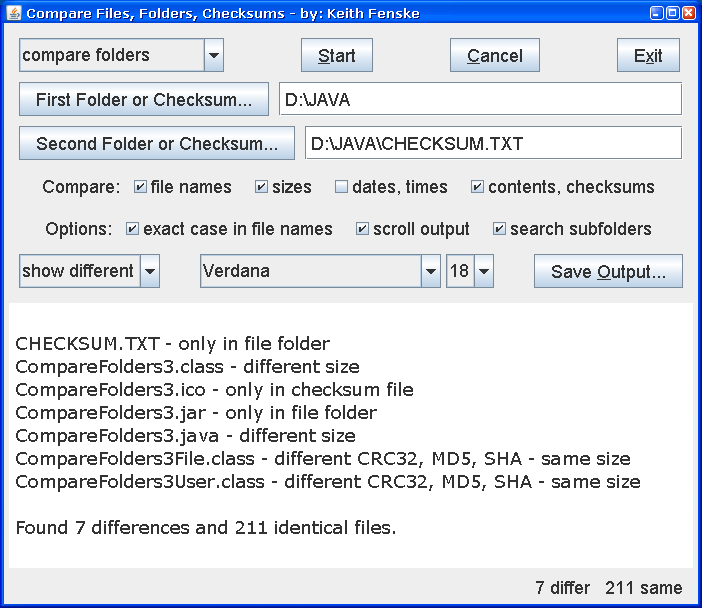

### Compare Folders (Java)

by: Keith Fenske, https://kwfenske.github.io/

CompareFolders is a Java 1.4 application to compare two folders to determine if
all files and subfolders are identical. The folders may be on the same
computer, on the local network, or they may be represented by checksum files.
Files or subfolders that are not the same are reported to the user. The
intention is to decide if two different distribution folders have the same
contents. You can:

1. Compare two folders. One or both folders may be represented by checksum
files.

2. Create a checksum file for a folder. This is the most efficient way of
remembering the contents of a folder for later comparison. After you back up
files to external media, and later restore them, how will you know they are
correct unless you have checksums from the original files?

3. Update a checksum by assuming that files have not changed if they have the
same name, date, and size. This is much faster than creating a new checksum for
large collections on a local disk drive. However, it is not recommended for
files copied over a network or downloaded from the internet.

Checksum files are used when the original files or folders are not available. A
checksum file is a plain text file in XML (Extensible Markup Language) format
with the name, size, and checksums for each file. Checksums are small
hexadecimal "signatures" for testing whether or not files have been copied
correctly, such as over a network. One person sends a file along with the
checksum computed on the original computer. A second person calculates a
similar checksum for the received file, and if the two checksums agree, then
the received file is assumed to be correct. This CompareFolders application
supports CRC32, MD5, SHA1, and optional SHA256 or SHA512 checksums. It is
extremely unlikely that two files will have the same MD5 or the same SHA
checksum and still be different (which can't be said about CRC32).

Download the ZIP file here: https://kwfenske.github.io/compare-folders-java.zip

Released under the terms and conditions of the Apache License (version 2.0 or
later) and/or the GNU General Public License (GPL, version 2 or later).

